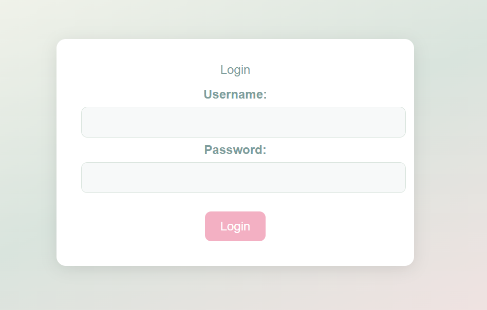
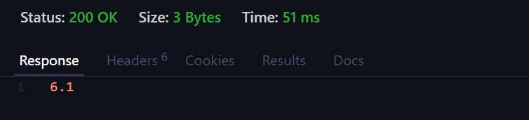
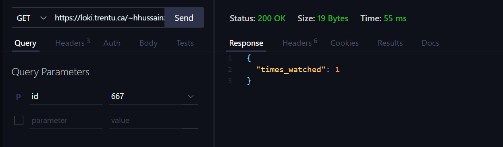
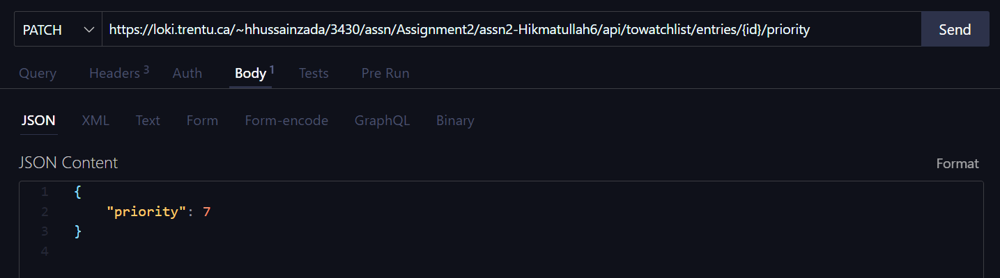

# Testing - Hikmatullah Hussain Zada, Maryam Alchoib

Please be sure to put all your testing-screenshots in this folder so they won't sync to Loki. You can assemble your testing document below. It only need to include well labelled screenshots of your testing (no code).

## Create Account Testing

This is the Create Account Page

Submitting without Email

Submitting with wrong email format

Submitting without Password

Submitting with wrong password format

Account Successfully Created

The Account in the database

## Index Page Testing

Index Page

## Login Page Testing

Login page

Submitting empty inputs

Submitting empty password

Submitting wrong inputs

## View Account Testing 

View Account Page

Regenerated API Key

# API Endpoints

## GET Method

Endpoints:

## `/movies`

## `/movies/{id}`

Invalid input

## `/movies/{id}/rating`

Invalid

## `/towatchlist/entries`
 
empty

Invalid API

Test with valid inputs

## `/completedwatchlist/entries`
 
empty

Invalid API

Test with valid inputs

## `/completedwatchlist/entries/{id}/times-watched`

 
Invalid API

Test with valid inputs

## `/completedwatchlist/entries/{id}/rating`

Invalid API

Test with valid inputs

## `/users/{id}/stats`

empty stats

Invalid User

Test with full entries

## POST Method

## `/towatchlist/entries`

Invalid input

## `/completedwatchlist/entries`

## `/users/session`

Wrong username or password

## PUT Method

## `/towatchlist/entries/{id}`

## PATCH Methods

## `/towatchlist/entries/{id}/priority`

## `/completedwatchlist/entries/{id}/rating`

## `/completedwatchlist/entries/{id}/times-watched`

## DELETE Methods

## `/towatchlist/entries/{id}`

Invalid Entry

## `/completedwatchlist/entries/{id}`

Invalid Entry

## Invalid Endpoint Test

